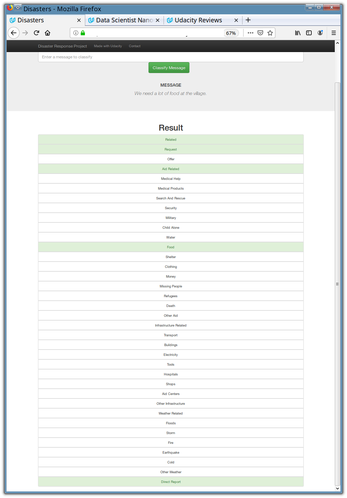

# Disaster Response Pipeline Project

## Introduction

The goal of this project is to create a machine learning pipeline to classify messages about disaster events so as to route them to the appropriate disaster relief agencies.

It includes three components
* An ETL pipeline that ingests and cleans data of messages of disaster events.
* A Machine Learning model that is trained to classify messages of disaster events.
* A Flask webapp that
	* Provides a web user interface for classifying messages
	* Visualizes the training data

## File Descriptions

```
	.
	├── app
	│   ├── run.py 				# Flask app start point
	│   └── templates
	│       ├── go.html 			# Classification result web page
	│       └── master.html 		# Main page of web app
	├── data
	│   ├── disaster_categories.csv 	# Source Dataset for categories
	│   ├── disaster_messages.csv 		# Source Dataset for messages
	│   └── process_data.py 		# ETL pipeline code
	├── models
	│   └── train_classifier.py 		# Message classifier training code
	└── README.md
```


## Instructions

1. Run the following commands in the project's root directory to set up your database and model.

    - To run ETL pipeline that cleans data and stores in database
        `python data/process_data.py data/disaster_messages.csv data/disaster_categories.csv data/DisasterResponse.db`
    - To run ML pipeline that trains classifier and saves
        `python models/train_classifier.py data/DisasterResponse.db models/classifier.pkl`

2. Run the following command in the app's directory to run your web app.
    `python run.py`

3. Go to http://0.0.0.0:3001/


## Project Demo

### Main Webpage of Data Visualizations


### Message Classification Demo

**Input:** We need a lot of food at the village.


